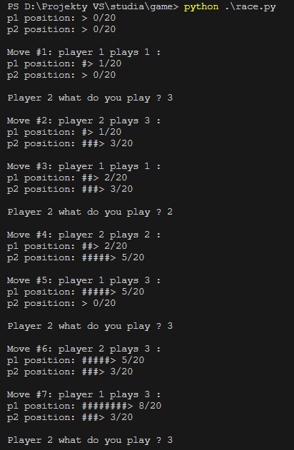
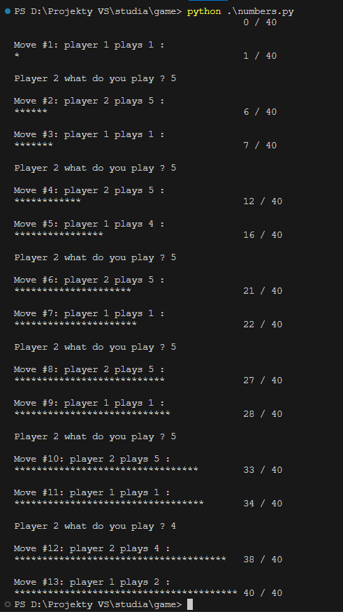

### Dlaczego dwie gry:

Na zajęciach wpadliśmy na pomysł gry wyścigowej ze zbijaniem (RACE) (jak w chińczyku) - jednak po napisaniu tej gry i walce z AI zauważyliśmy, że wystarczy na początku zbijać się cały czas i gra się zapętla, przez to że nie ma losowości, zawsze można wybrać pole na którym stał przeciwnik żeby go zbić już na początku. Na początku pomyśleliśmy, że możemy to rozwiązać przez dodanie losowości przy pierwszym ruchu, ale to też nie było idealne. Dlatego postanowiliśmy zrobić drugą grę. (NUMBERS)

# Instalacja

> git clone **link**

> cd nai-game

> pip install easyAI 

# Uruchomienie gry

### Gra 1
> python race.py

### Gra 2
> python numbers.py

# Gra 1 - Race

## Opis

Race to prosta gra turowa dla dwóch graczy, stworzona w języku Python z wykorzystaniem biblioteki easyAI. Gracze rywalizują, starając się dotrzeć do końca planszy przed przeciwnikiem. W przypadku, gdy obaj gracze trafią na to samo pole, gracz, który był tam pierwszy, wraca na początek planszy.

## Zasady Gry

**Gracze**: Gra jest przeznaczona dla dwóch graczy.

**Plansza**: Plansza składa się z 20 pól, numerowanych od 1 do 20. Celem gry jest dotarcie do ostatniego pola, czyli pola numer 20.

**Ruchy**: Rozgrywka odbywa się na przemian, zaczynając od Gracza 1. Gracze wykonują ruchy, przesuwając się o określoną liczbę pól w swojej turze.

**Możliwe Ruchy**: Gracz może wybrać, czy chce przesunąć się o 1, 2 lub 3 pola w jednym ruchu.

**Wygrana**: Gra kończy się, gdy jeden z graczy osiągnie lub przekroczy pole docelowe (pole numer 20). Gracz, który pierwszy dotrze na to pole, wygrywa grę.

**Zbijanie**: Jeśli obaj gracze trafią na to samo pole (np. obaj na polu numer 10), drugi gracz zostaje zmuszony do powrotu na pole początkowe (pole numer 1).

**Przykład Rozgrywki**:

  
Gra kontynuuje się, a gracze rywalizują, aż jeden z graczy osiągnie pole numer 20 i wygra grę.

# Gra 2 - Numbers

## Opis 

"Numbers" to gra w której dwaj gracze rywalizują, starając się być ostatnią osobą, która dodaje liczbę i uzupełnia łączną sumę do 100. 

## Zasady gry

**Gracze**: Gra jest przeznaczona dla dwóch graczy

**Cel Gry**: Celem gry jest doprowadzenie do sytuacji, w której przeciwnik musi dodać liczbę, aby łączna suma wynosiła 100. Wygrywa gracz, który jako ostatni dokona takiego ruchu.

**Ruchy**: Rozgrywka toczy się na przemian, zaczynając od Gracza 1. W każdej turze gracze wybierają liczbę, którą dodają do bieżącej sumy. Dostępne są liczby od 1 do 5.

**Wygrana**: Gra kończy się, gdy jeden z graczy zostawia drugiego w sytuacji, w której ten musi dodać liczbę i osiągnąć łączną sumę 100. Gracz, który osiągnął ten stan, wygrywa grę.

**Przykład rozgrywki**: 

  

## Implementacja AI

W grach użyto algorytmu Negamax z wykorzystaniem biblioteki easyAI do sterowania zachowaniem sztucznej inteligencji (AI). AI jest w stanie myśleć w przód, analizować możliwe ruchy i podejmować decyzje w oparciu o strategię, która dąży do zwycięstwa w grze.